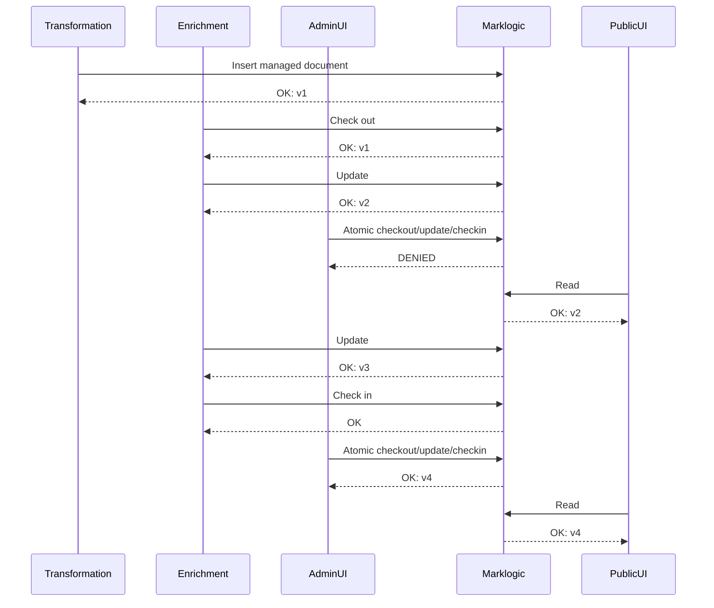

# 5. Use the Marklogic Library Services API for document versioning

Date: 2022-02-21

## Status

Superseded by [ADR 50](0050-update-data-structure.md)

## Context

We are storing our judgment data in Marklogic, as chosen by earlier research work, and previous experience with legislation.gov.uk.

We need to store judgments in LegalDocML format, as well as associated documents.

We need to keep multiple versions of judgments, so as to support editing, enrichment, and other tasks as well as simply display. These tasks will
all work with the shared Marklogic database as discussed in ADR 0003.

We need to coordinate between multiple editors to ensure that changes are not overwritten.

## Decision

Marklogic includes support for [Library Services](https://docs.marklogic.com/guide/app-dev/dls), designed to manage versioned content.

Documents are marked as being managed by Library Services, at which point they are fully version controlled.

In order to update a document, the client must "check out" the document, update it, then "check in" the new version. This prevents multiple clients
from updating the document at the same time, as only one client can check out a document at a time. This can be done in separate steps, and multiple updates can be done during a checkout, but it can also be done as a single atomic operation.

We will use the Library Services feature to manage our documents, and provide version control and synchronisation features.

We will define an initial [Retention Policy](https://docs.marklogic.com/guide/app-dev/dls#id_91470) that keeps _all_ previous versions of documents.

This sequence diagram is an example of how the various clients may interact with the same document.

The document is inserted by the Transformation Engine, then checked out by the Enrichment Engine. While the Enrichment Engine has the document checked out, the Admin UI cannot check it out for an update, though the Public UI can display it in a read-only fashion. Once the Enrichment Engine checks the document back in, the Admin UI can perform its own update.

## Consequences

The Library Services API is only available through XQuery; it is not exposed by default via the REST interface. We will consider how to expose the features to clients in a followup ADR focused on the API.
