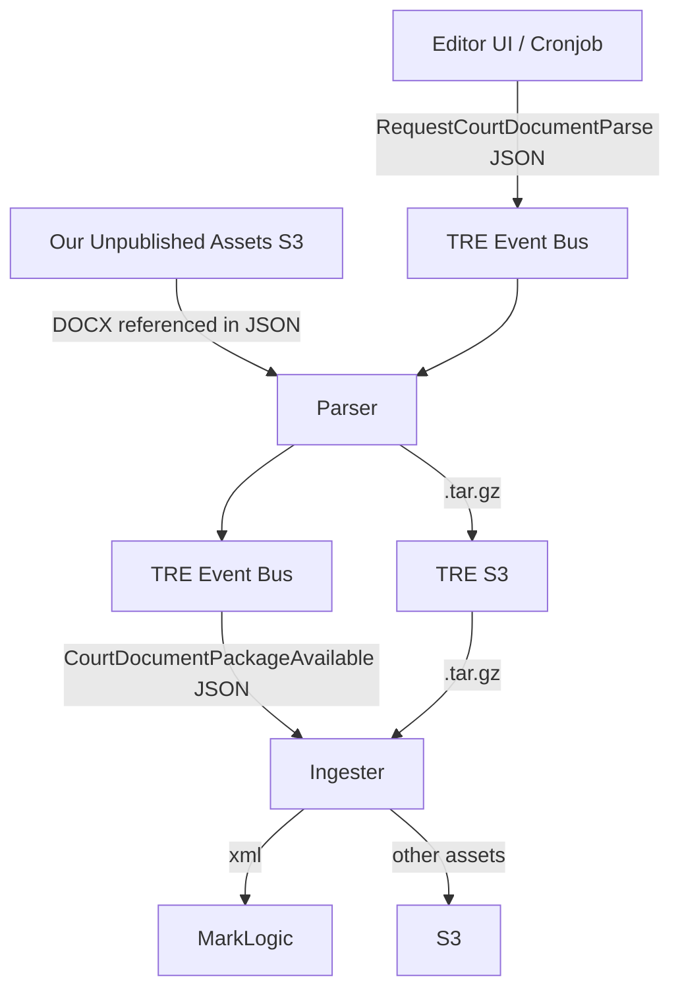

# 17. Reparsing

Date: 2024-04-09

## Status

Accepted

## Context

Documents that have been on the site for a while were parsed with an older version of the parser. There are a number
of improvements to the parser which have been made since which will not be reflected in the XML. We can resend a document to parser to get an up-to-date XML.

Naively, this would remove all the editor's human-approved metadata, so we must ensure that the metadata is preserved.
We do this by sending the metadata to the parser, which uses it preferentially to what it discovers in the document.
[We assume that either the metadata has been checked by a human if it's been published, or will be checked by a human
if it has not been published. This does leave a gap for documents which were initially bulk-published]

This also removes enrichment; we don't consider this to be a problem, as the automatic enrichment 1/minute trickle feed
will eventually reenrich all the documents.

(This shouldn't be conflated with the bulk parsing of documents that are new to Find Case Law, which recieves tar.gz
files in the `jim-bulk-data-notifier` S3 bucket and sends a notification directly to the ingester. Once ingested,
these documents can be reparsed as normal.)

## Decision



We send a message to TRE via the Event Bus SNS `{environment}-da-eventbus` following [this schema](https://github.com/nationalarchives/da-transform-schemas/blob/main/tre_schemas/avro/uk/gov/nationalarchives/da/messages/request/request-courtdocument-parse.avsc) which looks like this (see also [this example](https://github.com/nationalarchives/da-transform-schemas/blob/main/json-examples-new-schema/request-courtdocument-parse.json))

```json
{
  "properties": {
    "messageType": "uk.gov.nationalarchives.da.messages.request.courtdocument.parse.RequestCourtDocumentParse",
    "timestamp": "2023-01-01T12:00:00Z",
    "function": "fcl-judgment-parse-request",
    "producer": "FCL",
    "executionId": " d516fc84-7ceb-46e3-9949-cb6d2fdcdf16",
    "parentExecutionId": null
  },
  "parameters": {
    "s3Bucket": "MY_BUCKET",
    "s3Key": "test/2023/123/test_2023_123.docx",
    "reference": "TDR-12345",
    "originator": "FCL",
    "parserInstructions": {
      "name": null,
      "cite": "[2023] UKSC 1",
      "court": null,
      "date": null,
      "uri": "uksc/2023/1",
      "documentType": "judgment",
      "published": false
    }
  }
}
```

The Execution ID is a UUID.

Reference is the TDR reference of the original document or BULK-33333 if they came from Jim originally – but they live in the same field in the database anyway (`transfer-consignment-reference` in the non-document MarkLogic metadata).

`parserInstructions` sends hardcoded values for certain things that have either already been published or will be reviewed before publication. The documentType sets whether it’s treated by the parser as a judgment or press summary (spelled `pressSummary`)

`null` (or an absent field) in `parserInstructions` means that we should not presume that value and allow the parser to decide. The URI is particularly important since the ingester will then ensure it puts the finished document back in the same place it originally got it, and should probably always be set.

If `published` is true we autopublish the document – there are open questions about the implications of this if upstream was evil. We set this if the document was already published when the document was sent. Email notifications won’t be sent to editors if this flag is set.

The `s3Bucket` in which the DOCX is found needs to be set up with a AWS KMS encryption key which TRE can access. Old documents won't be readable because those weren’t encrypted with the new key so everything will need overwriting with a version with the new KMS key. We use the unpublished asset bucket so that it doesn’t matter whether the documents have been published or not; the assets in the public bucket that are not DOCX will be overwritten when it's published (or immediately if autopublishing is set.)

There are checks for the existence of the Word document to avoid sending unfulfilable requests to TRE.

The time of the last time the document was considered for reparsing is saved in the MarkLogic metadata as `last_sent_to_parser`.

We plan to automatically send documents to reparsing using a similar cronjob to the enrichment. We should only do this at
night to avoid conflicts with the editors. Similar to enrichment,
it should reparse the least-recently-reparsed document that
has a word document and is of an older version than the parser
currently emits.

There were intentions for a delay on the reparse button; these have been shelved for now. Challenges faced included a lack of clarity in the meaning of the times
(when successfully reparsed / when sent for reparsing). See [the pull request](https://github.com/nationalarchives/ds-caselaw-editor-ui/pull/1411) for more details.

## Consequences

### Enrichment is destroyed (temporarily)

The XML document will be completely rewritten by the parser (except for those fields specified above) and therefore all enrichment will be destroyed. The document will need to be re-enriched but should be picked up by the automatic enrichment process (assuming that it’s working and turned on.)

### tar.gz files overwritten with versions without DOCX

TDR don't send the docx back to us when reparsing because we've already got it; we intend to use the same TDR reference to refer to the document as before meaning that the targz file we get back is named the same, meaning it'll get stored in exactly the same place in S3 as the original, overwriting it.
In the event of the word document being overwritten by a splatting judgment, we won't be able to get the word document back in quite the same way we do now. If we don't make any changes, we should be able to fetch the docx from S3's version history which is a little bit more faff than now.
Other options include:
don't save the incoming TDR targz file. That makes debugging hard
save it under a different name? We could get a lot of different versions (and we're probably still paying for storage whether it's in the versioned history of a new name. Having a single 'TDR-2023-1-REPARSE.tar.gz' could help with that.

see https://github.com/nationalarchives/ds-find-caselaw-docs/pull/157/files?short_path=f00d5bc#diff-f00d5bc9df504d47fa2955efe5640b97aaff1d3fc625aba067464e814d3ec9aa
