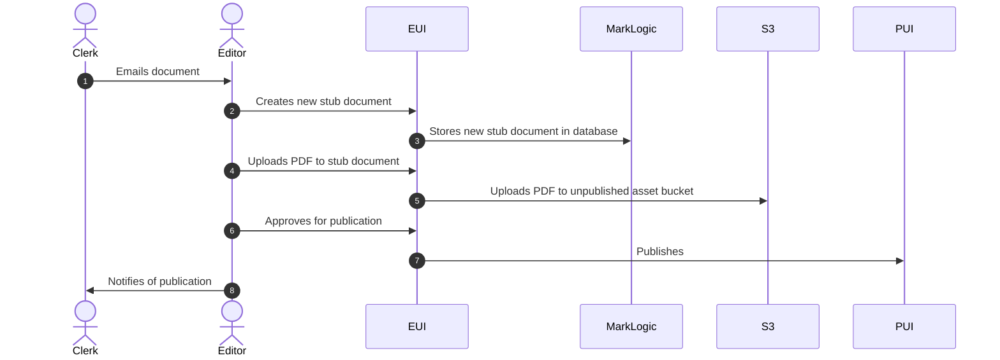

# 50. Process for uploading standalone PDF documents outside of TDR flow

Date: 2025-11-25

## Status

Accepted

## Context

There is a requirement for a small number of tribunals to be able to upload PDF documents directly, without providing a .docx document which can be parsed. The amount of work needed to make TDR accept PDF documents – but only from these tribunals, and then to process them without invoking the usual parser chain – is prohibitive.

## Decision

Given the small volumes involved, the process for ingesting these documents will be as follows:

1. The tribunal will manually notify the editorial team of a new decision to be uploaded, and will email the editors the PDF asset along with any relevant metadata (to be determined)
1. The editor will use the EUI to create a new 'stub' document in MarkLogic, by submitting an in-app form with the appropriate metadata
   - This stub document will be without assets, and will be in an unpublished (and unpublishable) state.
1. The editor will use the EUI to upload the PDF asset to the stub document
   - This will be uploaded to the EUI and then stored in the S3 unpublished assets bucket under the document's URI
   - Document processing/cleansing workflows will run for PDFs as usual
1. The editor will publish the document as usual
   - This will perform the usual copying of files to the S3 published assets bucket

### Diagram

## Consequences

- We will need to decide on and document the procedure and required information to send these documents to the editorial team. This is out of scope of this ADR.
- This introduces the need to maintain parity between the API's ad-hoc stub document creation method and the Parser's stub document creation method for bulk uploads, as well as introducing a need for parity in how court data is sourced. The details of change will be addressed in a future ADR.
