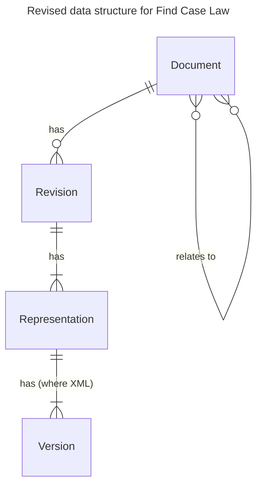

# 50. Update data structure to better represent concepts of documents, revisions, representations and versions.

Date: 2025-07-15

## Status

Proposed

## Context

The original data structure of the Find Case Law service was designed to provide a rapid path to deployment for the original corpus of documents, based on an initial set of requirements. This ultimately resulted in all information regarding a "document" being stored in a single entity within the MarkLogic database. This included [metadata](ADR0005) and [versions](ADR0005) of a document.

Since then the complexity of the service has grown to include a number of requirements not fully covered by this original design. These are testing the limits of the current data structure, requiring work-arounds, special cases or significant amounts of rework to handle things such as multiple document types, varying source documents, absent identifiers, changing identifiers, document relationships, multiple language representations, additional metadata, richer provenance and history, new reporting requirements and more.

It has reached the point where the prudent thing to do is to update the fundamental data structure to one which provides a better framework to meet these requirements. This ADR lays out a target model for this data structure.

### Existing ADRs

This ADR has been written with particular attention to the context of the following ADRs:

- [5. Use the Marklogic Library Services API for document versioning](ADR0005)
- [7. Use Document Properties To Store Non-LegalDocML Metadata](ADR0007)
- [14. Versioning of Documents](ADR0014)
- [18. Pseudo-NCNs](ADR0018)
- [19. Other Formats](ADR0019)
- [47. Uncouple document URIs and NCNs](ADR0047)
- [49. Confirm Document URIs, Identifiers, Atom Feed IDs, FRBR Model and S3 Asset Key Structure](ADR0049)

## Decision

We will implement a new underlying data structure to embody the following distinct concepts:

### Concepts

#### Document

A "document" in this framework is the abstract concept of a document, currently representing a judgment or other form of decision, or a press summary. We hold it to be broadly analogous to a "Work" under the FRBR[^frbr] model.

Documents are the overarching item in the data structure, and are what most people will actually mean when they talk about a "judgment". Each document MUST have a first-class database object which has been assigned MUST be assigned a unique, non-semantic identifier by Find Case Law.

Each document MAY have one or more other identifiers such as NCNs as detailed in [ADR 47](ADR0047). We MUST NOT assume the presence of any identifier which has not explicitly been assigned by the FCL service.

Where a relationship exists between two documents (eg "X is a press summary of Y") this relationship will be stored bidirectionally, ie "is summarised by" and "is a summary of" to simplify retrieval.

#### Revision

A revision represents a distinct submission of a document to the National Archives, usually by a court or tribunal. Under the FRBR model, this is analogous to an "Expression".

A revision SHOULD have a "source document" which we consider to be the canonical representation of the revision, and from which all other representations are derived. This will usually be a .docx file for all new submissions, but could also be other types of file for legacy ingestions or future submissions. It is possible that legacy ingestions will no longer have the original file available for all past revisions (although this will remain in The National Archives' preservation system).

Each representation MUST have a first-class database object which has been assigned a unique, non-semantic identifier by Find Case Law in the form of a UUID. We MUST NOT use TDR identifiers for this purpose, since some documents may arrive outside of the TDR process (for example historical ingestions), and a single TDR reference may relate to multiple documents (for example with bulk ingestions).

Each revision MUST record any provenance data provided by TDR and TRE where it exists, even if this data is only stored in a blob and not in a structured way. The TDR reference and submitter data MUST be stored as structured data.

We MAY choose in future to allow revisions to be marked as "minor", for example where the change is exclusively typographical and does not change the meaning of the document.

#### Representation

A representation is a revision expressed as a particular format, for example as .docx, PDF or LegalDocML.

Each representation MUST be assigned a unique identifier by Find Case Law in the form of a UUID.

A representation MAY be stored as more than one distinct file, for example an XML representation of a document may include not only XML, but also image assets. These MAY be stored in different logical locations, for example storing XML in MarkLogic and image assets in S3.

Some representations, such as HTML, are produced as in-app transformations of other representations without involving the data layer. These do not need to be stored separately. It is the job of the application to interpret requests for these alternative representations and act accordingly.

#### Version

Versions are (in this model) exclusively reserved for XML representations of a document stored in MarkLogic, and represent incremental changes to the document when it undergoes processes such as re-parsing, enrichment, or injection of updated metadata.

In the hypothetical situation where an XML representation is also the "source document" for a revision, the canonical version MUST always be the first version.

Each version MUST be assigned a unique identifier by Find Case Law in the form of a UUID.

#### Future concepts

As part of designing this framework we have considered the following future concepts. They have not been included in this ADR since they do not meet immediate user needs on the product roadmap:

##### Cases

Cases would effectively be ad-hoc groupings of one or more documents in a many-to-many type relationship, since one case could potentially include multiple decisions, press summaries or other documents, and one decision may actually involve several cases.

##### Translations

Translations are semantically different Expressions of the same Work under FRBR. Further research would be needed to flesh out the exact constraints required by our model (eg would a new major revision always imply a new translation was required).

#### Diagram

### Migration path

Existing work has helped us start to distinguish some of these concepts, meaning we are able to provide an incremental migration path. This reduces risk to the service as all changes can be designed to be smaller and incremental, maintaining a rollback path at all times.

## Consequences

- API Client will need incremental redesign to understand content within this new framework.
- It will be necessary to perform some data migrations of all existing documents into the new framework. These should be possible to do incrementally, rather than requiring a maintenance window.
  - For example, all existing document versions stored using MarkLogic DLS will need unpacking into distinct revisions.
- We will need to reconsider how searches are performed across the corpus. Potentially MarkLogic is capable of expressing searches in a way which is useful to us directly (and we would only need to modify the query to understand the new structure), but it may also be necessary to build an intermediate representation of the document for search purposes, particularly when we are storing multiple XML revisions or versions.

### Supersedes

- This supersedes [ADR 5](ADR0005), in that revisions of a submitted document (and versions of representations of that document) will now be stored as distinct entities without relying on MarkLogic's DLS.
- This supersedes [ADR 7](ADR0007), since metadata pertaining to the abstract concept of the document will now be stored in the document record.

[^frbr]: https://en.wikipedia.org/wiki/Functional_Requirements_for_Bibliographic_Records "Functional Requirements for Bibliographic Records"

[ADR0005]: 0005-use-the-marklogic-library-services-api-for-document-versioning.md "Use the Marklogic Library Services API for document versioning"
[ADR0007]: 0007-use-document-properties-to-store-non-legaldocml-metadata.md "Use Document Properties To Store Non-LegalDocML Metadata"
[ADR0014]: 0014-versioning-of-documents.md "Versioning of documents"
[ADR0018]: 0018-pseudo-ncns.md "Pseudo-NCNs"
[ADR0019]: 0019-other-formats.md "Other Formats"
[ADR0047]: 0047-uncouple-document-uris-and-ncns.md "Uncouple document URIs and NCNs"
[ADR0049]: 0049-confirm-document-uris-identifiers-atom-s3.md "Confirm Document URIs, Identifiers, Atom Feed IDs, FRBR Model and S3 Asset Key Structure"
