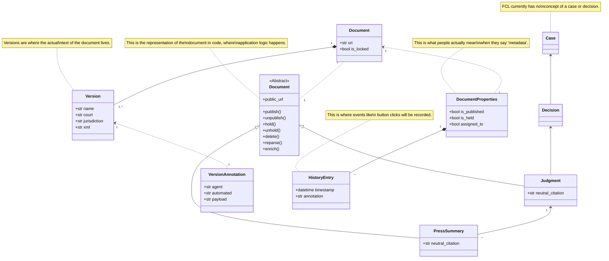

# Class diagram

This represents the key classes for storing and manipulating data in the Find Case Law system.

```mermaid
classDiagram

    class Case {
    }

    class Decision {

    }

    note for Case "FCL currently has no\nconcept of a case or decision."

    class Judgment {
        +str neutral_citation
    }

    class PressSummary {
        +str neutral_citation
    }

    class Document {
        <<Abstract>>
        +public_url

        +publish()
        +unpublish()
        +hold()
        +unhold()
        +delete()
        +reparse()
        +enrich()
    }

    Document <|-- Judgment
    Document <|-- PressSummary

    Case <-- Decision
    Decision <-- Judgment

    Judgment "1" <-- "*" PressSummary

    note for Document "This is the representation of the\ndocument in code, where\napplication logic happens."

    class MLDocument["Document"] {
        +str uri
        +bool is_locked
    }

    class DocumentProperties {
        +bool is_published
        +bool is_held
        +bool assigned_to
    }

    class Version {
        +str name
        +str court
        +str jurisdiction
        +str xml
    }

    class VersionAnnotation {
        +str agent
        +str automated
        +str payload
    }

    class HistoryEntry {
        +datetime timestamp
        +str annotation
    }

    note for DocumentProperties "This is what people actually mean\nwhen they say 'metadata'."

    note for Version "Versions are where the actual\ntext of the document lives."

    note for HistoryEntry "This is where events like\n button clicks will be recorded."

    MLDocument "1" .. "1" Document

    MLDocument "1" *-- "1..*" Version
    MLDocument "1" <.. "1" DocumentProperties

    Version "1" <.. "1" VersionAnnotation

    DocumentProperties "1" *-- "*" HistoryEntry
```
