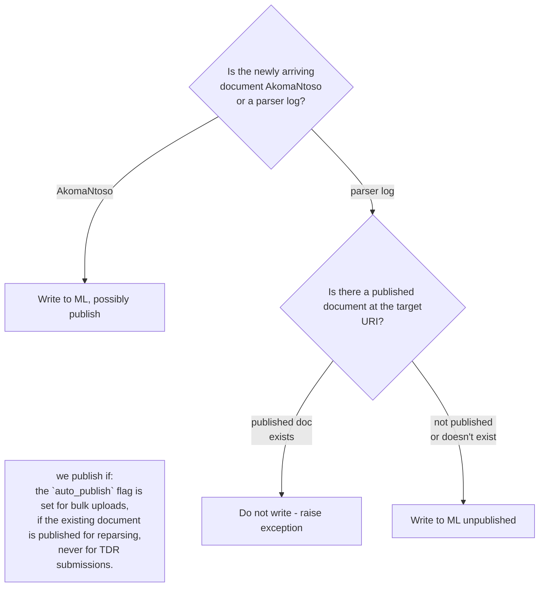

```mermaid
flowchart TD
    valid?{"Is the newly arriving \n document AkomaNtoso\n or a parser log?"}
    pub?{"Is there a published \n document at the target URI?"}
    auto["Write to ML, possibly publish"]  ~~~ autotext["we publish if:
    the `auto_publish` flag is set for bulk uploads,
    if the existing document is published for reparsing,
    never for TDR submissions."]
    nowrite["Do not write - raise exception"]
    unpub["Write to ML unpublished"]
    valid? -->|AkomaNtoso| auto
    valid? -->|parser log| pub?
    pub? -->|published doc\n exists| nowrite
    pub? -->|not published\n or doesn't exist| unpub
```

(The `auto_publish` flag is either True, False or doesn't exist in the dictionary. It must be True to publish.)
