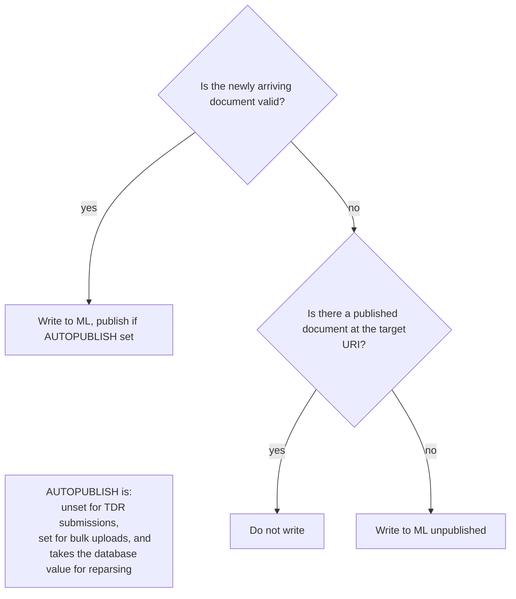

```mermaid
flowchart TD
    valid?{"Is the newly arriving document valid?"}
    pub?{"Is there a published \n document at the target URI?"}
    auto["Write to ML, publish if AUTOPUBLISH set"]  ~~~ autotext["AUTOPUBLISH is:
    unset for TDR submissions,
    set for bulk uploads, and
    takes the database value for reparsing"]
    nowrite["Do not write"]
    unpub["Write to ML unpublished"]
    valid? -->|yes| auto
    valid? -->|no| pub?
    pub? -->|yes| nowrite
    pub? -->|no| unpub
```
