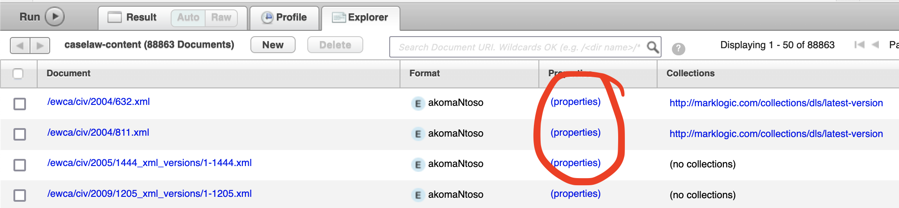

# Modifying documents

Occasionally documents aren't in the right place because they've got the wrong URI, for example, due to incorrect neutral citation in the case of judgments.

For any document with incorrect URI:

- if the URI isn't already used, we can just delete the document,
- if the URI is already used, we will need to instead restore the previous document.

When we refer to a document, it will have:

- its current XML representation as well as any historic versions of the XML in the MarkLogic database
- metadata which is is also stored in MarkLogic as document properties (not to be confused with MarkLogic document metadata). It is not a part of the XML document, but is associated directly with it. For example, the `is_published` properties controls logic for whether the document is published or not.
- associated assets in AWS S3 buckets:
  - the original docx
  - a pdf generated automatically from the original docx on ingestion
  - any image files found in the original docx.

Furthermore, there can be 2 of these AWS buckets - one for unpublished documents, and one for published documents `tna-caselaw-unpublished-assets` and `tna-caselaw-assets` respectively on production. We need to make sure we account for all of these when manually modifying any document.

## Deleting a document

Steps to do this:

### 1. Deleting the XML from MarkLogic

There is a short script that can be used in the MarkLogic console:

```xquery
xquery version "1.0-ml";

import module namespace dls = "http://marklogic.com/xdmp/dls" at "/MarkLogic/dls.xqy";

let $uri := "/ewhc/kb/1899/123.xml"
let $keep_old_versions := fn:false()
let $retain_history := fn:false()

return dls:document-delete($uri, $keep_old_versions, $retain_history)
```

which will return nothing on success and an error on failure.

The XML data can be accessed by logging into the MarkLogic Console via the VPN, ensuring the `caselaw-content` database is selected, hitting Explore and viewing the file tree at the bottom.


Versions in directories suffixed `_xml_versions` are the non-current saved XML version, and the first part of the filename is the same as the version number on the Editor interface. (This folder does not contain the most recent version).

We've not investigated whether deleting them from the Console UI works the same way.

Note: deleting the XML document will delete any associated metadata as well, since, although it isn't contained in the XML itself, it is associated with the MarkLogic document.

### 2. Deleting the assets from S3

Assets are copied from the unpublished bucket to the public bucket when the document is published.

We need to delete the folders in these buckets for the document in question. The structure of the

1. Log into the production environment AWS console
2. Navigate to each of the 2 buckets, and delete them.
   

## Restoring an older version of a document

Steps to do this:

### 1. Restoring the XML from MarkLogic

In the MarkLogic console, we can copy-paste the text from the previous version we want to restore to the `latest` version (e.g from `/ewca/2022/99_xml_versions/2-99.xml` to `/ewca/2022/99.xml` will restore version 2 of `/ewca/2022/99.xml`). In addition to restoring the `latest` version, this will automatically generate a new version in the `_xml_versions` folder. In the example above, if the ost recent numbered version was `/ewca/2022/99_xml_versions/3-99.xml`, then `/ewca/2022/99_xml_versions/4-99.xml` will be created.

More automatic approaches using the console probably exist.

### 2. Restoring the metadata from MarkLogic

Whilst it's possible to copy-paste the metadata XML in a similar way, it's not clear when that's appropriate.

It's not clear at this point what we should be doing with this: this might need carefully thinking about.


### 3. Restoring the assets from S3

1. Log into the production environment AWS console
2. For each bucket `tna-caselaw-unpublished-assets` and `tna-caselaw-assets` that a folder exists for this document:
   1. Access the s3 folder `$bucket-name/$document-name/`, which should have all the TDR archives of all versions present (e.g. `TDR-2022-SN3.tar.gz`) as well as the latest version's pdf and doc
   1. Download and unpack the archive of the TDR package we want to restore from
   1. Upload these files back to the bucket. (This may overwrite the current latest version being used.)

Note: Whenever a `.docx` file is added to the S3 bucket, a PDF file will automatically be created by the [pdf-conversion](https://github.com/nationalarchives/ds-caselaw-pdf-conversion) lambda function. Most of the time the `.docx` file will have been overwritten too (which provoked the overwriting of the PDF) but deleting the PDF and reuploading the docx should trigger PDF creation.

Note: We are hoping to get S3 versioned buckets on production so that restoring older assets on s3 will be much more simple.
