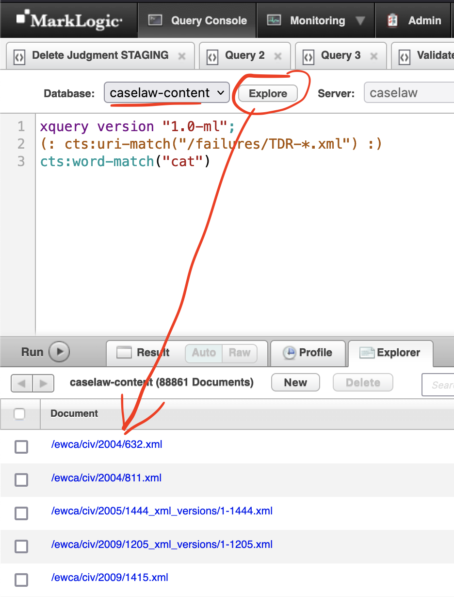
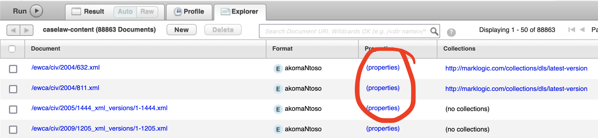
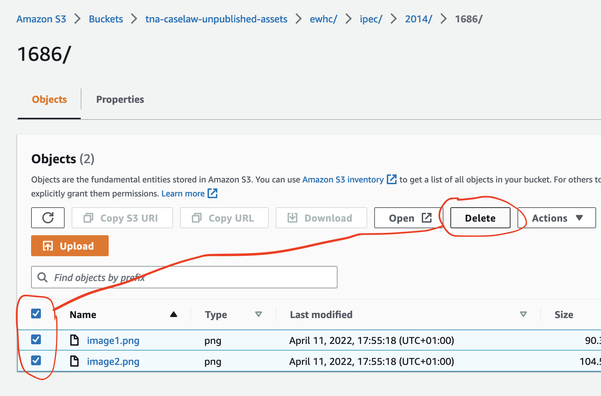

## Modifying judgments

Occasionally judgments aren't in the right place because they've got the wrong neutral citation.

If the neutral citation incorrectly used isn't already used, we need to delete that judgment,
and if it is, we will need to restore the previous judgment.

Judgments are made of a few key parts which we'll take in turn:

### The XML data

This can be accessed by logging into the MarkLogic Console via the VPN, ensuring the `caselaw-content` database is selected, hitting Explore and viewing the file tree at the bottom.



Versions in directories suffixed `_xml_versions` are the non-current saved XML version, and the first part of the filename is the same as the version number on the Editor interface. (This folder does not contain the most recent version).

### Restoring the XML

We can copy-paste the text from the automatically saved versions (e.g from `/ewca/2022/99_xml_versions/2-99.xml` to `/ewca/2022/99.xml`. This will automatically generate a new version in the `_xml_versions` folder.

More automatic approaches using the console probably exist.

### Deleting the XML

There is a short script that can be used in the console:
```xquery
xquery version "1.0-ml";

import module namespace dls = "http://marklogic.com/xdmp/dls" at "/MarkLogic/dls.xqy";

let $uri := "/ewhc/kb/1899/123.xml"
let $keep_old_versions := fn:false()
let $retain_history := fn:false()

return dls:document-delete($uri, $keep_old_versions, $retain_history)
```

which will return nothing on success and an error on failure.

We've not investigated whether deleting them from the Console UI works the same way.

## The metadata
The metadata is also stored in MarkLogic, but is not a part of the XML document, but is associated directly with it. This controls things like 'is the document published'.

It's not clear at this point what we should be doing with this: this might need carefully thinking about.




### Restoring the metadata

Whilst it's possible to copy-paste the metadata XML in a similar way, it's not clear when that's appropriate.

### Deleting the metadata

Metadata will be deleted when you delete an XML file.

## The S3 Buckets

There are two important S3 buckets -- on live, they are `tna-caselaw-unpublished-assets` and `tna-caselaw-assets`. Assets are copied from the unpublished bucket to the public bucket when the document is published.

### Deleting the S3 contents

Log into the S3 console and delete the files by using the checkboxes to the left for the files, then hit delete.


### Updating the S3 contents

We are hoping to get S3 versioned buckets on live, but for now there are often TDR archives present (e.g. `TDR-2022-SN3.tar.gz`). Downloading and unpacking this locally should give you access to the files that were overwritten, then you can upload the files via the orange Upload button.

### A note on PDFs

Whenever a `.docx` file is added to the S3 bucket, a PDF file will automatically be created by the [pdf-conversion](https://github.com/nationalarchives/ds-caselaw-pdf-conversion) lambda function. Most of the time the `.docx` file will have been overwritten too (which provoked the overwriting of the PDF) but deleting the PDF and reuploading the docx should trigger PDF creation.
