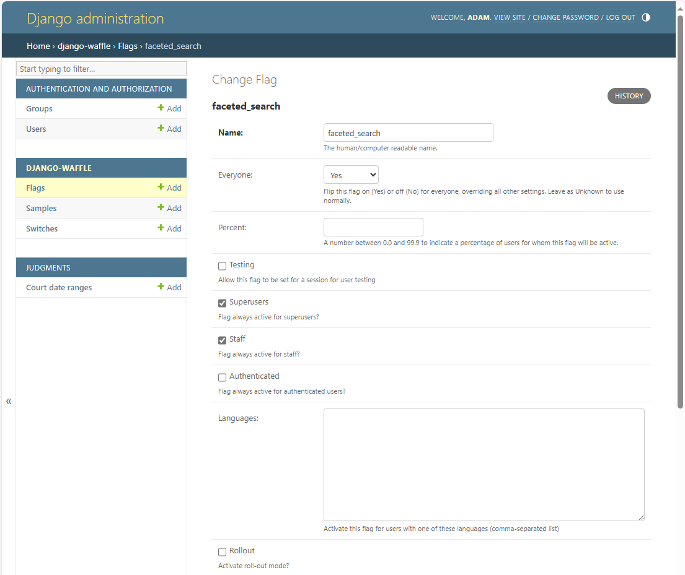
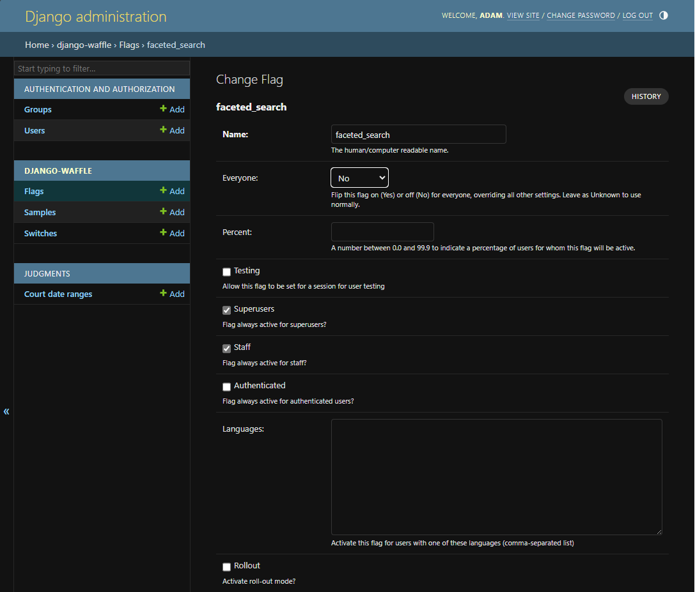

# Using feature flags

We use [Django Waffle](https://waffle.readthedocs.io/en/stable/) for feature flags. They’re available in the Public and Editor UIs.

## Creating and modifying flags in the admin menu

Log into the admin interface – /django for the PUI, or /admin for the EUI.

In local development environments, you may have to use /admin/ (note the trailing slash).

In the admin interface you’ll see a subsection named ‘django-waffle’. Pick ‘flags’ to edit an existing flag, or the + icon next to ‘flags’ to make a new one.




Pick a name – the name should match what you configured within your code. The convention is to use ‘snake_case’.

There's a number of different options to configure the visibility and reach of the feature behind the flag. In most cases we use the “Testing“ option. You can set “Everyone” if you want to ensure no-one/everyone sees the flag. Hit ‘SAVE’.

## Activating the flag for user testing

Visit any URL with a parameter of `?dwft_{flag_name}=1` to turn testing on for that user; `=0` to turn it off, where {flag_name} is to be replaced with the name of the flag assigned as above.

This will set a session cookie on the user's browser, that will enable the feature for the duration of that session.

## Using flags in HTML templates

[Documentation](https://waffle.readthedocs.io/en/stable/usage/templates.html#flags)

This is the only way we’ve used flags so far.

```


    flag_name is active!

    flag_name is inactive

```

## Using flags in Python views:

[Documentation](https://waffle.readthedocs.io/en/stable/usage/views.html#flags)

Inside a view, you can access the flag status via `waffle.flag_is_active(request, 'flag_name')`

## Labs

The Editor interface has a way to turn on features for yourself at [/labs](https://editor.staging.caselaw.nationalarchives.gov.uk/labs).

[judgments/views/labs.py](https://github.com/nationalarchives/ds-caselaw-editor-ui/blob/main/judgments/views/labs.py) has a list of the current experiments.
