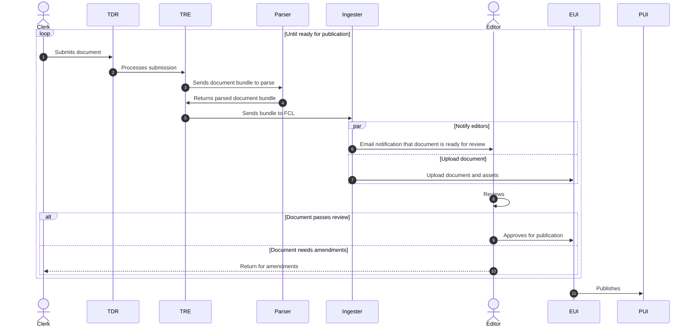

# Document workflow overview

This is a high-level overview of the workflow a document goes through from submission to publication

```mermaid
sequenceDiagram
  autonumber

  actor Clerk
  participant TDR
  participant TRE
  participant Parser
  participant Ingester
  actor Editor
  participant EUI
  participant PUI

  loop Until ready for publication
    Clerk->>TDR: Submits document
    TDR->>TRE: Processes submission
    TRE->>Parser: Sends document bundle to parse
    Parser->>TRE: Returns parsed document bundle
    TRE->>Ingester: Sends bundle to FCL
    par Notify editors
      Ingester->>Editor: Email notification that document is ready for review
    and Upload document
      Ingester->>EUI: Upload document and assets
    end
    Editor->>Editor: Reviews
    alt Document passes review
      Editor->>EUI: Approves for publication
    else Document needs amendments
      Editor-->>Clerk: Return for amendments
    end
  end
  EUI->>PUI: Publishes
```
